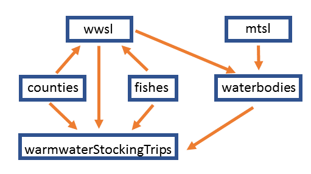
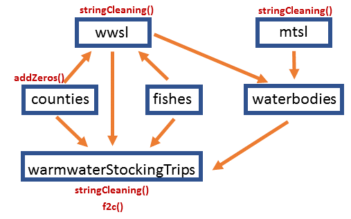

---
# YAML header metadata passes options to rmarkdown::render
#YAML options
title: "{NCIFD} Demo"
author: "A. Powell Wheeler"
date: "March 24, 2022"
output:
 pdf_document:
  toc: true
#subtitle: version 1.0.1
#LATEX options
geometry: margin=0.25in
fontsize: 10pt
urlcolor: blue
---

```{r setup, eval= TRUE, include=FALSE} 
#include = FALSE tells R not to print this particular code chunk in the output
#fontsize = 10 and margin = 0.25 give 114 R console character width (font actually printing 14.25 characters per inch) and formatting consumes 3 of those characters = 111
#fontsize = 12 and margin = 0.25 give 94 R console character width (font actually printing 11.75 characters per inch) and formatting consumes 3 of those characters = 111
#fontsize = 10 and margin = 0.5 give 104 R console character width and formatting consumes 3 of those characters = 106
options(width = 111) #applies to R output, page width is 114 characters, but Rmarkdown gives up 3 characters with it's formatting
knitr::opts_chunk$set(echo = TRUE) #this line tells knitr to print the code chunks by default
R_ver <- paste(R.Version()['major'],R.Version()['minor'], sep='.')
rmarkdown_ver <- packageVersion('rmarkdown')
knitr_ver <- packageVersion('knitr')
NCIFD_ver <- packageVersion('NCIFD')
RStudio_ver <- rstudioapi::versionInfo()$version
```

**This document** was written in Rmarkdown (`r rmarkdown_ver`) on R (`r R_ver`) and rendered on `r format(Sys.time(),"%B %d, %Y at %H:%M")` in RStudio (`r RStudio_ver`) using NCIFD (`r NCIFD_ver`) and knitr (`r knitr_ver`).

<!-- #some janky code to find console width in rendered PDFs -->
<!-- ```{r include=TRUE} -->
<!-- paste0(rep('X', 94-9), collapse = "") #94 is total width b/c loses 9 characters due to formatting-->
<!-- ``` -->

# R, RStudio, and R Packages
## R
R is the free and open-source programming language that is becoming the standard tool for data analysis, not just in science, but across disciplines. 

## RStudio 
RStudio is the free and open-source IDE (Integrated Desktop Environment) that is used by 99.99% of R users. It runs R inside of it and has lots of helpful features that make R easier to use. RStudio is, undoubtedly, one of the reasons for the success of R.

Although they are a for-profit company, [RStudio is also Public Benefit Corporation which means they have legally-binding altruistic goals](https://www.rstudio.com/about/what-makes-rstudio-different/) including keeping RStudio free for individual users. [They make money selling and supporting enhanced versions of their free products for industry](https://rviews.rstudio.com/2016/10/12/interview-with-j-j-allaire/), which is a common open-source software business model. Thus, there is no rational basis to fear that after investing your time in learning RStudio, you might have it taken away or somehow be forced to pay for it. 

+ The RStudio IDE actually renders a web page on your screen. Thus, it looks and works the same across platforms (Windows, MacOS, and Linux) and you could remotely access and use a powerful RStudio server through your web browser.
+ Dark theme: tools -> global options -> appearance -> Editor Theme. I use Ambiance or Sky.
+ Four panels can be resized or minimized by dragging their frames.
+ Code editor panel can be dragged to a separate monitor. 
+ Tab autocomplete in console
+ Up and Down Arrows to access previous commands
+ If you haven't upgraded to a 1080p Full High Definition screen already, now is a good time. FHD screens became common about 10 years ago and the screen real estate will help with RStudio.

## R Packages 
R Packages allow R users to share functions and data sets with each other. [CRAN](https://cran.r-project.org/), the primary website for downloading R packages currently hosts [> 18k](https://cran.r-project.org/web/packages/available_packages_by_name.html). R packages are most commonly used to share functions, but they are also useful for data distribution. The main goal of NCIFD is to increase the availability and usefulness of NCWRC data sets among IFD staff, but it also stores some functions you may find useful.

# What can a Division R Package Do for Us?
## Data Sets
IFD has many relatively small (by R standards) data sets that are useful outside of a single district but are often difficult to find because they are scattered throughout the Division and Agency and there is no single source for their distribution. In addition, the data sets are typically difficult to use because they are not arranged neatly in 2-dimensions and/or are very messy. For examples:

+ Some data is available through PAWS but the exported data is very messy and requires arduious clean-up before it is usable.
   + MTSL (2011-present) - years are separate spreadsheets, difficult to piece together, waterbody names not standardized
   + WWSL (2011-present) - years are separate spreadsheets and difficult to piece together, waterbody names not standardized
   + NCARP - can only be downloaded by species groups, freedom units
   + Coldwater Stocking Trips: no county names, no waterbody names, freedom units, some bad waterbody and county codes, some wrong and missing PMTW classifications, some trips entered twice, water temps in mixed units
+ Data from on-going fisheries research projects has no home on PAWS 
   + Black Bass Genetics - plus each sample results are separate spreadsheets in differing formats
   + Wild Trout Distribution
   + Wild Trout Barriers
+ Other data sets have no distribution 
   + MTSL (2001-2010) - spreadsheets on Deaton's computer
   + WWSL (2005-2010) - spreadsheets on Deaton's computer
   + Waterbody Codes - full collection is only available in print (Fish 1968)
   + Coldwater Stocking Coordinates - spreadsheet on Scott Marsh's computer
   + County Codes - on a PDF scan of an old piece of paper on Scott Marsh's computer
   + Missing Reports - spreadsheet on Powell's computer
   + Raleigh Library Contents - spreadsheet on Shauna Glover's computer
   + Fish Species codes - no definitive source. PDF scans are found throughout the agency and some are PAWS. There are some inconsistencies among sources.

## Functions
We can make R functions to solve IFD problems or share our homebrew functions inside the Divison.

# Introduction to {NCIFD}
{NCIFD} is an R package for the Inland Fisheries Division (IFD) of the North Carolina Wildlife Resources Commission. It contains functions and data sets authored by the staff. The first non-beta version 1.0.0 'Aggressive Alosid' was released on 2022-02-08 and a 'patch' version 1.0.1 was released recently. Minor releases with new and updated functions and data sets are expected every July (after the spring stockings), November (after the normal fall stockings), and February (after the new MTLSs and WWSLs are finalized).

## Install {NCIFD}
{NCIFD} is just for IFD use and distributed from a MS Teams group for IFD R-users. E-mail [Powell Wheeler](mailto:powell.wheeler@ncwildlife.org) if you want access to the shared folder. There are 5 files available after each release: 

1. NCIFD_source.zip contains the source code. Its a zip-compressed directory structure that holds all the files that build the package. 
2. IntroToNCIFD.pdf is a general overview of the package.
3. NEWS.pdf is the historical change log and some anticipated future changes.
4. NCIFD_X.X.X.zip installs NCIFD on MS Windows computers. To install the package in Windows, download and install it through RStudio's menus (Tools -> install.packages). 
5. NCIFD_X.X.X_R_x86_64-pc-linux-gnu.tar.gz installs NCIFD on a Linux computer. 

## Load Library
```{r check_install, eval=TRUE, include=TRUE, warning = FALSE}
library(NCIFD) #the library function makes NCIFD available in R
path.package('NCIFD') #NCIFD is stored in a directory on your hard drive. library() lets R access the directory.
```

## Getting Help
{NCIFD} has package-wide help that includes information about the project, as well as all the data sets and functions in the package. In RStudio, you can click links to view the specific help information for all the functions and data sets and there are hyperlinks for internet resources also. Everything in the package has useful help information.
```{r help_NCIFD, eval=FALSE, include=TRUE}
help(NCIFD) #not run
```
Demonstrate package-wide help(NCIFD) in RStudio
+ Hyperlinks to internet resources
+ Internal Links to detailed information on package functions and data sets.

# {NCIFD} Data Sets
Although the data sets in the package are often available elsewhere in the Agency, the versions in the package are substantially improved and are instantly available in an R session. The data sets are updated when new versions of the package are released. It only takes about half a worker-day to update all the data sets, re-build the package, and release a new version. 

+ Admin
  + accountCodes. Contents of the PAWS database of Inland Fisheries Division publications. 
  + staff. Work contact information for NCWRC employees.
+ NC Information
  + counties. Code, district, and region information for NC counties.
  + waterbodies. Waterbody codes from Fish (1968).
  + fishes. Information on NC fishes including their official NCWRC abbreviations, common names, taxonomy, state and federal status, distribution, and ITIS numbers.
+ Research Resources
  + afsFishes. Official list of fish names from the AFS.
  + missingReports. A list of known NCWRC publications that are not available on PAWS. Many are currently lost.
  + raleighLibrary. Inventory of > 3300 items available in the IFD and WMD libraries in the Raleigh Office.
  + reports. Contents of the PAWS database of Inland Fisheries Division publications.
+ Research Projects
  + blackBassGenetics. Results of the on-going Black Bass Genetics Project.
  + troutBarriers. Fish movement barriers on NC wild trout streams.
  + troutDist. Distribution of wild trout in NC.
+ Fishing
  + ncarp. NCARP awards database records.
  + stateRecords. Current NC fishing records.
+ Hatchery System
  + coldwaterStockingCoords. All the current trout stocking points.
  + coldwaterStockingTrips. All coldwater stocking records since July 1, 1991.
  + warmwaterStockingTrips. All warmwater stocking records since 2003 and some older ones back to 1972.
  + wwsl. All the warmwater fish stocking requests from 2011-present, plus some older entries back to 2005.
  + mtsl. All the Public Mountain Trout Water fish stocking requests beginning in 2001.
+ Other
  + townCoords. Average GPS coordinates of USA towns and cities.
  + zipCodeCoords. USPS ZIP Codes and their approximate GPS coordinates.

## Browsing data in R
It's difficult to browse data in R. This is often disorientating for those coming to R from Excel. Here are several ways to view data:

1. Just type 'wwsl + ENTER' in the console window. If you type an object name and don't tell R what to do with it, R tries to print it out in the console window. This works for functions also.
```{r viewWholeData, eval=FALSE, include=TRUE}
wwsl #did not run. If you don't tell R what to do with something it will try to print to the screen.
```

```{r headHeadWholeData, eval=TRUE, include=TRUE}
head(wwsl) #only show top 6 rows. Notice it overflows the screen and wraps around.
```
2. Use RStudio's Spreadsheet Interface
```{r viewWithSpreadsheetInterface, eval=FALSE, include=TRUE}
View(wwsl) #or open in IDE
```
3. Export the data set to a CSV file and view it in a spreadsheet program.
```{r exportDataAsCSV, eval=TRUE, include=TRUE}
write.csv(wwsl, file = '~/Downloads/troutDist.csv', row.names = FALSE) 
```
4). {NCIFD} also has four functions that help browse data: dfScan(), dfCols(), dfSlim(), and ferret(). See {NCIFD} functions. 

## Help for data sets
Help information for package data sets contains all the metadata that you need to understand the data.
```{r help_troutDist, eval=FALSE, include=TRUE}
help(troutDist) #not run
```

+ format 
  + data.frame: 2-dimensional data (like a spreadsheet)
  + number of rows and columns
  + column contents
+ author - who did the R coding to get it in the package (Powell)
+ source
  + person overseeing the data (Jake)
  + last update updated
+ examples - not very useful for data sets
 
## Data Sets Depend Each Other
The data sets in {NCIFD} often aggregate information from each other. For example, 'warmaterStockingTrips' contains numeric codes for county names and uses 'counties' to decode them (e.g., 944 = Haywood). In addition, it uses 'fishes' to decode species codes into species names and 'waterbodies' and 'wwsl' to convert waterbody codes into waterbody names (Figure 1). R's ability to merge data from other data sets is more powerful than lookup functions in Excel and less powerful than relational databases.



## Data Sets in the Source Code
Look at coldwaterStockingTrips in source code as an example

+ NCIFD/data-raw
  + R scripts that clean-up the data and save it 
+ NCIFD/data
  + Data sets in R *.rda format
+ NCIFD/R
  + Help Information coded in Roxygen2
+ NCIFD/tests
  + Automated testing
  + Package has too many interconnected parts to check everything all the time
  + Sometimes find detect problems in the raw data, especially if hand-keyed

## Uses of NCIFD Data: Graphs
Run scripts for automation/reproducability with coldwaterStockingTrips

+ July PMTW Water Temperatures
  + temps.july.script.r
+ Trout Stocking Requests and Results by Stream
  + stockingByWaterbodyByYear.R
+ Trout Harchery Requests and Output
  + totalHatcheryOutput.R

# {NCIFD} Functions
{NCIFD} contains a variety of functions. Some of the functions have specific IDF uses such as cleanBIODE(), relativeWeight(), standardWeight(), others were created to help with specific research projects, and others help build the package.

+ cleanBIODE() cleans-up MS Excel files produced when querying the BIODE database in PAWS.
+ flow() calculates stream flow from interval velocity and depth measurements.
+ ordinalDate() assigns ordinal dates (1:365).
+ Basic Statistics
  + movingAverage() calculates moving average.
  + quick2Sample() two-sample inferential tests (t- and z-tests) for summarized data.
+ Fisheries Statistics
  + relativeWeight() calculates fish relative weight.
  + standardWeight() calculates fish standard weight.
  + Z2A() converts instantaneous mortality rate (Z) to annual mortality rate (A) along with the SE and calculates CIs.
+ Console Tools
  + dfCols() displays information about the columns in a data.frame including their class and address.
  + dfScan() views an evenly distributed subset of the rows in a data.frame.
  + dfSlim() views only as many data.frame columns as will fit cleanly across your console window.
  + ferret() finds rows in a data.frame which have a match for one or more search terms.
  + fruitSalad() creates a data.frame with information about fictitious salads.
  + reveal() reveals the libraries and objects that are active in your workspace.
+ Unit Conversion Functions: ac2ha(), c2f(), cubft2cubm(), cubft2gal(), cubm2cubft(), deg2rad(), f2c(), ft2m(), g2lb(), gal2cubft(), ha2ac(), in2mm(), kg2lb(), km2mi(), lb2g(), lb2kg(), m2ft(), mi2km(), mm2in(), rad2deg().

+ {NCIFD} Development (Figure 2)
  + addZeros() adds zeros to the start or end of a string. Replaces zeros that were lost when spreadsheets treat an identifier, such as a PIT tag number, like a number and drop leading and trailing zeros.
  + lake2End() if a waterbody name starts with 'Lake', move it to the end of the name. So, 'Lake Fontana' becomes 'Fontana Lake'.
  + stringCleaning() corrects a universe of bad formatting often found in 'note' columns and decodes > 100 common IFD abbreviations.
  + wordFreq() finds the frequencies of words (by looking for spaces) in a vector or data.frame column. Its helps check the preformance of stringCleaning().  



## cleanBIODE()
Cleans-up EXCEL files exported from PAWS BIODE queries.
```{r cleanBIODE, eval=FALSE, message=FALSE, warning=FALSE, include=TRUE}
cleanBIODE('~/Downloads/BiodeQuery03-07-22.xlsx') #makes an object in your R Session
cleanBIODE('~/Downloads/BiodeQuery03-07-22.xlsx', writeFiles=TRUE) #cleans-up and saves as CSV files on HDD
```

## standardWeight()
Calculates standard weight for 47 NC fishes.

+ species info in hidden data.frame: NCIFD:::wsLookup
 + some species have multiple equations
  + Defaults to most useful in NC (BKT) or most general (MKY)
+ references for a standard weight equations are in help(standardWeight) in AFS format
+ tested against published and known values - NCIFD/tests/testthat/test_condition.R
+ alias: ws()

```{r standardWeight, eval=TRUE, message=FALSE, warning=FALSE, include=TRUE}
standardWeight('BKT', 150) #defaults to eq='A' (Harris et al. 2021); SABKT are skinnier
standardWeight('BKT', 150, eq='B') #eq='B' selects Hyatt and Hubert (2001)
standardWeight('BKT', 100) #Harris et al. (2021) works down to 80 mm TL
standardWeight('BKT', 100, eq='B') #Hyatt and Hubert (2001) returns a NA when < 120 mm TL
ws('BKT', 150) #ws() is an alias for standardWeight()
```

## relativeWeight()
Calculates relative weight of 47 NC fishes

+ skip calculating _W~s~_ and get _W~r~_ directly
+ uses standardWeight()
+ tested against published and known values - NCIFD/tests/testthat/test_condition.R
+ alias: wr()

```{r relativeWeight, eval=TRUE, message=FALSE, warning=FALSE, include=TRUE}
relativeWeight('BKT', 150, 32.7) #relative weight also accepts fish TL. It calls standardWeight() internally.
relativeWeight('BKT', 150, 32.7, eq='B')
wr('BKT', 150, 32.7) #wr is an alias for relativeWeight()
```

## Z2A()
Quickly convert an instantaneous mortality rate (Z) to an annual mortality rate (A). Also, converts the standard error and bootstraps confidence intervals with the gamma distribution. Thanks to Kyle Rachels for adding the CIs.

```{r Z2A, eval=TRUE, message=FALSE, warning=FALSE, include=TRUE}
Z2A(0.69) #no SE specified
Z2A(0.69, 0.1) #with SE; defaults to 95% CIs
Z2A(0.69, 0.1, 0.99) #with SE and custom CI
```

## Data.frame viewing functions
Because viewing data in R can be difficult, the package contains four functions to help.

1. dfCols(); shows a summary of what is contained in the data.frame columns. This mimics how tibbles print in RStudio.
```{r dfCols, eval=TRUE, message=FALSE, warning=FALSE, include=TRUE}
dfCols(zipCodeCoords)
```

2. dfScan(); shows X number of evenly-spaced rows in a data.frame, including the first and last.
```{r dfScan, eval=TRUE, message=FALSE, warning=FALSE, include=TRUE}
dfScan(afsFishes, 10)
```

3. dfSlim(); drops the right-side columns that won't fit on your screen to prevent wrap-around. Works on a Linux terminal, in RStudio, and even in Rmarkdown documents.
```{r dfSlim, eval=TRUE, message=FALSE, warning=FALSE, include=TRUE}
dfSlim(head(coldwaterStockingTrips)) #used head() to only print first six rows
```

4. ferret(): searches data.frames for strings and returns the rows that have matches. It is designed to quickly find information in {NCIFD} data.frames. With some package familiarity and practice, you can use it while talking to anglers on the phone. By default, it finds case-insensitive partial matches. For example, searching for 'WY' will match 'wy', 'wY', and 'hwy'. However, if exact=TRUE, 'WY' will only match 'WY'. Here's some examples of how I've used it:

 + Is Charles D. Owen Pond still getting winter pond stockings?
```{r ferret01, eval=FALSE, message=FALSE, warning=FALSE, include=TRUE}
ferret(coldwaterStockingTrips, 'charles')
```

 + You jerks only stocked Big Snowbird HS once all last year!
```{r ferret02, eval=FALSE, message=FALSE, warning=FALSE, include=TRUE}
ferret(coldwaterStockingTrips, c('snowbird', '2021')) #search for two strings at once with c()
```

 + When are Striped Bass typically stocked in Lake Hiwassee?
```{r ferret03, eval=FALSE, message=FALSE, warning=FALSE, include=TRUE}
ferret(warmwaterStockingTrips, c('sb', 'hiwassee'))
```

 + Find all of David Yow’s Creel Reports
```{r ferret04, eval=FALSE, message=FALSE, warning=FALSE, include=TRUE}
ferret(reports, c('Yow', 'creel'))
```

 + What months are Bear, Cedar Cliff, Wolf and Tanassee Stocked?
```{r ferret05, eval=FALSE, message=FALSE, warning=FALSE, include=TRUE}
ferret(mtsl, 'bear|cedar cliff|wolf|tanassee') #do an OR search with pipe symbol |; only works with exact=FALSE
```

 + What data do you have from Calderwood, Santeetlah, Cheoah, and Emory reservoirs?
```{r ferret06, eval=FALSE, message=FALSE, warning=FALSE, include=TRUE}
ferret(reports, 'Calderwood|Santeetlah|Cheoah|Emory')
```

 + When are Walleye normally stocked?
```{r ferret07, eval=FALSE, message=FALSE, warning=FALSE, include=TRUE}
ferret(warmwaterStockingTrips, 'wy') #problem: finds 'wy' in notes "hwy"
#try exact matching
ferret(warmwaterStockingTrips, 'WY', exact = TRUE) #notice case sensitive
```

## ordinalDate()
Converts dates into ordinal dates. For example, calling ordinalDate() on "2008-01-01" returns 1 and "2000-01-02" returns 2. This is useful for creating a common Jan-Dec x-axis when plotting multiple years of a time-series. R dates returns integers and POSIXct dates return decimal numbers. 
```{r ordinalDate, eval=TRUE, message=FALSE, warning=FALSE, include=TRUE}
#R Date Format
ordinalDate(as.Date(c("1/1/2000", "07/01/1999", "12/31/1970"), format = '%m/%d/%Y'))
#POSIXct date and time format
dates <- c('2020-02-28 12:00:00', '2020-02-29 12:00:00', '2020-03-01 12:00:00')
ordinalDate(as.POSIXct(dates, tz = 'GMT+5'))
```


# Conclusion
R is exposing us to a world of new tools which increase our ability to use and manage our own data. A Division R package is something that we can build and develop ourselves to improve and share data sets internally. In addition, we can build functions to accomplish common tasks and share those in the package also. This relatively new technology allows us to handle some problems that pervoiusly required professional IT support. Ultimately, {NCIFD} is and will be developed by field staff and it may help us cooperate and collaborate laterally across geographic divisions.

# Post Script
btw, R is also a stat's package.


